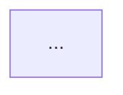

# Pack graph generation

Generate dependency and inclusion graphs from a `manifest.yml`.

## CLI

- DOT (Graphviz):

```powershell
labki graph manifest.yml --format dot --output graph.dot
```

- Mermaid (for docs/readmes):

```powershell
labki graph manifest.yml --format mermaid --output graph.md
```

Wrap the output in a mermaid code fence to preview:



- JSON (for programmatic use / MediaWiki extension):

```powershell
labki graph manifest.yml --format json --output graph.json
```

## Styling

- Pages are colored by namespace (Template, Form, Category, Property, Module, Help, MediaWiki, Main).
- Packs are colored by simple kind:
  - content: has pages, no dependencies
  - aggregator: has pages and dependencies
  - meta: no pages, depends on 2+ packs
  - other: fallback
- Edges:
  - page → pack: includes (blue)
  - pack → pack: depends_on (gray dashed)

## Rendering DOT locally (optional)

```powershell
winget install Graphviz.Graphviz
# or: choco install graphviz -y

dot -Tsvg graph.dot -o graph.svg
```

## CI usage

See `docs/ci.md` for job examples. A reusable workflow is available at `.github/workflows/graph.yml`.

- Manual run (workflow_dispatch) in this repo uses `tests/fixtures/basic_repo/manifest.yml` by default.
- For other repos, call the workflow and pass `manifest_path` if needed.
