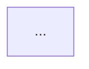

# Labki Packs Tools

This package provides CLI tools for validating a Labki content pack manifest and generating a graph of packs/pages.

Tools:
- labki-validate: Validate a manifest against the schema and repository rules
- labki-graph: Emit a Graphviz DOT graph of packs and pages

Quick start (Windows PowerShell):

1. Create and activate a virtualenv

    ```powershell
    python -m venv .venv
    . .\.venv\Scripts\Activate.ps1
    python -m pip install --upgrade pip
    ```

2. Install the project in editable mode

    ```powershell
    python -m pip install -e .
    ```

3. Run the tools

    ```powershell
    # Validate a manifest
    labki-validate validate tests/fixtures/basic_repo/manifest.yml

    # Generate DOT graph from a manifest
    labki-graph tests/fixtures/basic_repo/manifest.yml --format dot --output graph.dot
    ```

Other formats:

- Mermaid (for docs/readmes/GitHub rendering):

```powershell
labki-graph tests/fixtures/basic_repo/manifest.yml --format mermaid --output graph.md
```

In Markdown, wrap the output with a mermaid code fence for preview:



- JSON (for MediaWiki extension or other tooling):

```powershell
labki-graph tests/fixtures/basic_repo/manifest.yml --format json --output graph.json
```

If the commands are not found, either re-activate the venv or use one of these options:
- Full path to console scripts:

```powershell
 .\.venv\Scripts\labki-validate.exe validate tests/fixtures/basic_repo/manifest.yml
 .\.venv\Scripts\labki-graph.exe tests/fixtures/basic_repo/manifest.yml --format dot --output graph.dot
```

- Module form (no console scripts needed):

```powershell
python -m tools.validate_repo validate tests/fixtures/basic_repo/manifest.yml
python -m tools.graph_repo tests/fixtures/basic_repo/manifest.yml --format dot --output graph.dot
```

Graph rendering (optional):
- Install Graphviz locally to render DOT → SVG/PNG

```powershell
winget install Graphviz.Graphviz
# or
choco install graphviz -y

dot -Tsvg graph.dot -o graph.svg
```

Notes:
- Shared YAML/JSON helpers live in `tools/utils/common.py`.
- For CI examples and future outputs (Mermaid, JSON for MediaWiki), see `docs/graph_tools_plan.md`.
